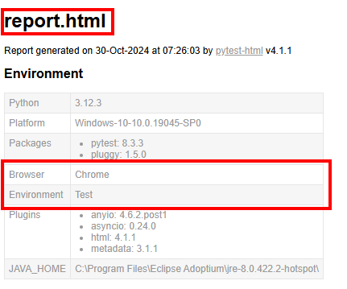
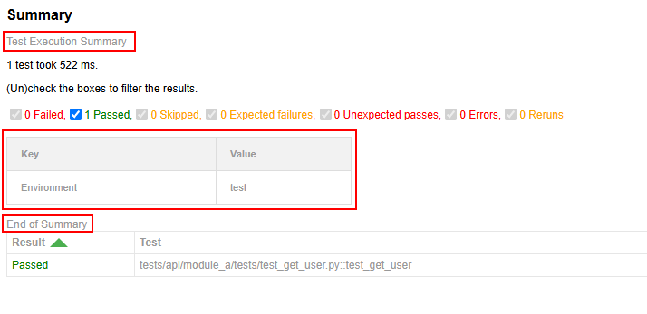
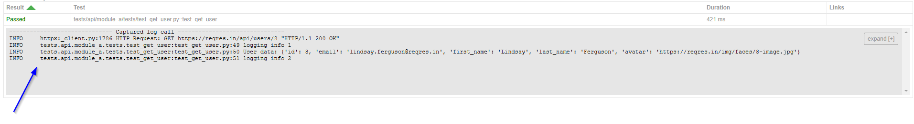
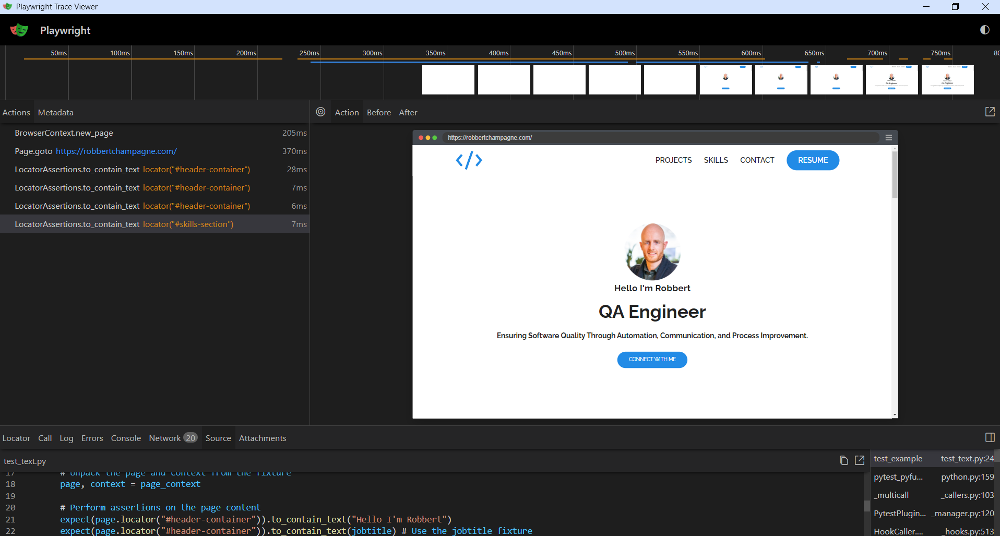

<a id="top"></a>

# Python-testing-framework
<div style="display: flex; align-items: center;">
    
    
</div>

# Virtual environments:

**To install pytest, playwright, httpx, and more in your virtual environment, you can use the following commands:**

**Run the following command to create a virtual environment:**
```Bash
python -m venv python-testing-framework
```

**Activate the virtual environment:**
```Bash
python-testing-framework\Scripts\activate
```

**Install packages:**
```Bash
pip install pytest playwright httpx python-dotenv aiofiles pytest-html jsonschema pytest-asyncio
```

**Install the playwright plugin:**
```Bash
pip install pytest-playwright
```

**Install playwright browsers:**
```Bash
playwright install
```

**Export the installed packages to a requirements.txt file:**
```Bash
pip freeze > requirements.txt
```

**Done? -> Deactivate the virtual environment:**
```Bash
deactivate
```

**Install packages from requirements.txt:**
```Bash
pip install -r requirements.txt
```

**To list all virtual environments created using venv or other tools like virtualenv, you can use:**
```Bash
dir /s /b activate
```
[↑ Back to top](#top)

# Running tests

Running all tests in a directory:
```Bash
pytest tests/api/module_a
```

Running all tests in a file:
```Bash
pytest tests/api/module_a/tests/test_marks.py 
```

Running a specific tests in a file:
```Bash
pytest tests/api/module_a/tests/test_marks.py::test_get_user_parametrize 
```

Running a specific mark from a file:
```Bash
pytest tests/api/module_a/tests/test_marks.py -m custom_mark
```

Running all the marks from the project:
```Bash
pytest -m custom_mark
```

[↑ Back to top](#top)

# API Testing

### Setup
To ensure that your imports work correctly with pytest, you typically need to follow these steps:

1. **Ensure `__init__.py` files are present**: Make sure that each directory in your package has an `__init__.py` file.<br> 
This file can be empty but is necessary for Python to recognize the directory as a package.

    Your directory structure should look like this:
    ```Bash
    python-testing-framework/
    ├── pytest.ini
    ├── tests/
    │   ├── __init__.py
    │   ├── api/
    │   │   ├── __init__.py
    │   │   │
    │   │   ├── core/
    │   │   │   ├── __init__.py
    │   │   │   ├── api_logging.log
    │   │   │   ├── html_summary.py
    │   │   │   ├── logging_config.json
    │   │   │   ├── loggingSetup.py
    │   │   │   └── apis_info.py
    │   │   │
    │   │   ├── module_a/
    │   │   │   ├── __init__.py
    │   │   │   ├── conftest.py
    │   │   │   │
    │   │   │   ├── setup/
    │   │   │   │   ├── __init__.py
    │   │   │   │   └── cognito_token.py
    │   │   │   │
    │   │   │   ├── tests/
    │   │   │   │   ├── __init__.py
    │   │   │   │   └── test_get_user.py
    ```
2. **Use relative imports**: to reference modules within the same package.<br> For example, in `test_get_user.py`, you should use:
    ```Python
    from ...core.apis_info import ApiAbbreviation, apiUrls
    ```

3. **Set the `PYTHONPATH` environment variable**: to the root directory of your project to ensure Python can find the modules correctly.<br> This step is necessary if you are running the tests from a different directory.
    ```Bash
    set PYTHONPATH=C:\xxx\xxx\python-testing-framework
    ```

4. **Run pytest from the root directory**: of your project to ensure it can find all the necessary modules and packages.
    ```Bash
    pytest -s tests/api/module_a/tests/test_get_user.py --html=report.html
    ```
[↑ Back to top](#top)

---

### Global fixtures

In pytest, you can create global fixtures by defining them in a file called `conftest.py`.<br>
This file should be located in your project's root directory or in any directory containing tests.<br>
Pytest will automatically discover `conftest.py` files and the fixtures defined in them,<br> 
and these fixtures will be available to all tests in your project/folder.

`conftest.py`
```Python
import pytest
import os
from dotenv import load_dotenv
from .setup.cognito_token import unlink_cognito_token, write_cognito_token
from ..core.html_summary import pytest_html_results_summary
from ..core.loggingSetup import setup_logging 
import logging

# Load environment variables from .env file
load_dotenv()

# Setup logging configuration
setup_logging()
logger = logging.getLogger("API Module A")

# scope='session' means that the fixture is called once per test session.
# If you don't specify a scope, the fixture will be called once per test function.
@pytest.fixture(scope="session")
def env():
    return os.getenv("ENVIRONMENT")

@pytest.fixture(scope="session")
def base_url(env):
    return f"https://{env}.website123.be"

@pytest.fixture(scope="session", autouse=True)
async def setup_temp_token():
    # Setup code: runs before any tests
    print("Session started")
    await write_cognito_token()
    
    yield  # This is where the test code runs
    
    # Teardown code: runs after all tests
    print("Session finished")
    await unlink_cognito_token()

# Hook to add a title to the HTML report
@pytest.hookimpl(tryfirst=True)
def pytest_html_report_title(report):
    report.title = "API Module A Tests"
```
`env()` & `base_url(env)`<br>
Functions like these can be used inside the tests without importing them.
module_a/tests/test_imports.py

```Python
# Example of using fixtures directly in a test function
@pytest.mark.asyncio
async def test_fetch_env_vars(env, base_url):
    # env & base_url are automatically provided by the fixtures inside module_a\conftest.py
    print(env)
    print(base_url)
```

`setup_temp_token()`<br>
The code before the yield statement runs before any tests.<br> 
In this example, it prints "Session started" and runs the asynchronous function to write the Cognito token.<br>
**yield**: This statement marks the point where the fixture's setup code ends and the test code begins.<br> 
The test code runs after the yield statement.<br>
**Teardown Code**: The code after the yield statement runs after all tests have completed.<br> 
In this example, it prints "Session finished" and runs the asynchronous function to unlink the Cognito token.<br>

**Recommendation**:<br>
Using a fixture with **scope="session"** is generally recommended for managing setup and teardown in pytest, especially when dealing with asynchronous code.<br> 
Fixtures provide a more flexible way to manage resources and dependencies, and they natively support asynchronous code when using pytest-asyncio.<br> 
Not like: `pytest_sessionstart(session)` & `pytest_sessionfinish(session, exitstatus)`

[↑ Back to top](#top)

---

### Hooks

Are special functions that pytest will automatically call at certain points during the testing process.<br><br>
`def pytest_sessionstart(session):`<br>
This function is a pytest hook that is automatically called once before any tests or test cases are run.

`def pytest_sessionfinish(session, exitstatus):`<br> 
This function is another pytest hook that is automatically called once after all tests and test cases have finished running.<br>
This might be done to clean up after the tests, or to ensure that the token isn't accidentally used outside of the testing session.

The `session` parameter in both `pytest_sessionstart` and `pytest_sessionfinish`<br>
is a Session object that contains information about the testing session, such as the tests that are being run and their status.<br>
The `exitstatus` parameter in `pytest_sessionfinish` is the exit status of the testing session,<br> 
which can be used to determine if the tests passed or failed.

```Python
# Pytest hooks like pytest_sessionstart and pytest_sessionfinish do not support asynchronous functions directly.
# You need to run the coroutine in the event loop manually.
def run_async(async_func):
    # Run the asynchronous function in the event loop
    asyncio.get_event_loop().run_until_complete(async_func)
    
def pytest_sessionstart(session):
    # Hook that runs at the start of the test session
    print("Session started")
    # Run the asynchronous function to write the Cognito token
    run_async(write_cognito_token())

def pytest_sessionfinish(session, exitstatus):
    # Hook that runs at the end of the test session
    print("Session finished")
    # Run the asynchronous function to unlink the Cognito token
    run_async(unlink_cognito_token())
```
These functions will not work correctly when running in parallel please use the functions explained in: [Global fixtures](#global).

[↑ Back to top](#top)

---

### HTML reports
For generating HTML reports in pytest, the most commonly recommended tool is pytest-html.<br> 
It is a plugin for pytest that generates a detailed HTML report for test sessions.<br> 
This report includes the summary of the test outcomes, categorization of tests (passed, failed, skipped, etc.),<br> 
and can also include additional information like logs, links, and screenshots if configured.

Run pytest with HTML report option: When running pytest, add the `--html` flag followed by the name of the report file you wish to generate.<br> 
This command will execute your tests and generate an HTML report named `report.html` in your current directory.

```Bash
pytest --html=report.html
```

1. **Custom Report Title**: to set a custom title for the HTML report.

```Bash
pytest --html=report.html --html-report-title="My Test Report"
```

2. **Include Environment Section**: To include an environment section in the report, you can use the --metadata option to add each key-value pair.

```Bash
pytest --html=report.html --metadata Browser Firefox --metadata Environment Test
```

You can put many pytest configuration options, including those for pytest-html, into a configuration file so you don't need to enter them every time you run a script.<br>
The most commonly used configuration file for pytest is `pytest.ini`

```Python
[pytest]
addopts =
    --html=report.html
    --metadata Browser Chrome
    --metadata Environment Test
```


(Environment can also be set inside the `conftest.py` file comming from the `.env` file)<br><br>
This configuration will automatically apply the specified options every time you run pytest, generating an HTML report titled "report.html" with the additional metadata and custom CSS specified.

For options that cannot be directly included in the configuration file, like adding extra links or assets through markers or modifying the pytest metadata within a test, you'll need to handle those within your test files or through custom plugins or hooks.

Remember to place the `pytest.ini` file at the root of your project or in a location where pytest can automatically detect it.

**HTML report configuration for this framework:**

`pytest.ini` :<br>
Specifies the HTML report output file:
```Python
[pytest]

...

addopts =
    --html=report.html
```

`conftest.py`<br>
Imports the custom HTML summary function:
(You do not need to call it directly; pytest will call it as part of its hook system.)
```Python
from ..core.html_summary import pytest_html_results_summary
```


`html_summary.py` :<br>
Contains the custom HTML summary function for the pytest-html plugin.<br> This function adds environment information to the HTML report in a styled table format.
```Python
import os

def pytest_html_results_summary(prefix, summary, postfix):
    environment = os.getenv("ENVIRONMENT")
    
    # Create a table with environment information using raw HTML and CSS
    table_html = """
    <style>
        .summary-table {{
            width: 20%;
            border-collapse: collapse;
            margin: 15px 0;
            font-size: 11px;
            text-align: left;
        }}
        .summary-table th, .summary-table td {{
            padding: 12px 15px;
            border: 1px solid #ddd;
        }}
        .summary-table th {{
            background-color: #f2f2f2;
        }}
    </style>
    <table class="summary-table">
        <tr>
            <th>Key</th>
            <th>Value</th>
        </tr>
        <tr>
            <td>Environment</td>
            <td>{}</td>
        </tr>
    </table>
    """.format(environment)
    
    # Add custom content to prefix
    prefix.extend(["Test Execution Summary"])
    
    # Add the table to the summary
    summary.extend([table_html])
    
    # Add custom content to postfix
    postfix.extend(["End of Summary"])
```


[↑ Back to top](#top)

---
### Logging
The logging configuration is set up using a JSON file and a setup script.<br>
This configuration ensures that logs are written to both the console and a file, and are also captured for inclusion in the HTML report.<br>
(Remove the 'console' logger else the output will show twice inside of the HTML report.)

`logging_config.json` :
```Python
{
    "version": 1,
    "disable_existing_loggers": true,
    "formatters": {
        "standard": {
            "format": "%(asctime)s - %(name)s - %(levelname)s - %(message)s",
            "datefmt": "%Y-%m-%d %H:%M:%S"
        }
    },
    "handlers": {
        "console": {
            "class": "logging.StreamHandler",
            "level": "INFO",
            "formatter": "standard",
            "stream": "ext://sys.stdout"
        },
        "file": {
            "class": "logging.FileHandler",
            "level": "INFO",
            "formatter": "standard",
            "filename": "api_logging.log",
            "mode": "a",
            "encoding": "utf-8"
        }
    },
    "loggers": {
        "": {
            "level": "INFO",
            "handlers": ["console", "file"]
        }
    }
}
```
`loggingSetup.py` :
```Python
import logging
import logging.config
import json
import os

def setup_logging():
    #Setup logging configuration
    path = os.path.join(os.path.dirname(__file__), 'logging_config.json')
    
    with open(path, 'r') as f:
        config = json.load(f) # Load the logging configuration from the JSON file
    
    # Dynamically set the absolute path for the .log file
    log_file_path = os.path.join(os.path.dirname(__file__), 'api_logging.log')
    
    # Clear the log file before adding new logs
    # This is optional and can be removed if you want to append logs to the existing file
    with open(log_file_path, 'w'):
        pass
    
    config['handlers']['file']['filename'] = log_file_path
    
    # Configure logging using the dictionary loaded from the JSON file
    logging.config.dictConfig(config) 
```

`conftest.py` :<br>
```Python
from ..core.loggingSetup import setup_logging 

# Setup logging configuration
setup_logging()
logger = logging.getLogger("API Module A")
...

```
`test_get_user.py` :<br>

```Python
import logging

# Setup logging configuration
logger = logging.getLogger("get user") 

# Log the user data (for capturing in the HTML report)
logger.info(f"User data: {user}")

...
```
<br>

`report.html` :<br><br>


`api_logging.log` :
```Log
2024-11-08 07:19:26 - API Module A - INFO - Starting session
2024-11-08 07:19:27 - httpx - INFO - HTTP Request: GET https://reqres.in/api/users/8 "HTTP/1.1 200 OK"
2024-11-08 07:19:27 - get user - INFO - User data: {'id': 8, 'email': 'lindsay.ferguson@reqres.in', 'first_name': 'Lindsay', 'last_name': 'Ferguson', 'avatar': 'https://reqres.in/img/faces/8-image.jpg'}
2024-11-08 07:19:27 - API Module A - INFO - Session finished
```

[↑ Back to top](#top)

---

### Marks

Pytest marks allow you to categorize your tests, making it easier to manage and execute subsets of your test suite based on certain criteria.

`@pytest.mark.slow`:
- **Purpose**: This mark is used to label tests that are slow to execute. You can use this mark to exclude or specifically include slow tests during test runs, optimizing your development workflow.<br>
- **Example Usage**: Running only fast tests by excluding the slow ones with a command like `pytest -k "not slow"`.

`@pytest.mark.xfail`:
- **Purpose**: Marks a test that is expected to fail. This is useful when a known bug is present, and the test will pass once the bug is fixed.<br>
- **Example Usage**: Allows the test suite to pass in a CI/CD pipeline despite the presence of a known failing test, without hiding the test failure.<br>
    ```Python
    @pytest.mark.xfail(reason="This test is expected to fail due to bug #123")
    ```

`@pytest.mark.skip`:
- **Purpose**: Skips the execution of the marked test function. This is useful for tests that are not applicable under certain conditions or if a feature is not yet implemented.<br>
- **Example Usage**: Temporarily disabling a test that relies on a feature not yet available in the development environment <br>
    ```Python
    @pytest.mark.skip(reason="Skipped because feature #456 is not yet implemented")
    ```

`@pytest.mark.custom_mark`:
- **Purpose**: Demonstrates how to create a custom mark. Custom marks can be used to categorize tests in any way that suits your project's needs.<br>
- **Example Usage**: Running a specific subset of tests tagged with a custom mark, like `pytest -m custom_mark`.<br>
- To use custom marks in pytest, you need to register them in your pytest configuration file (usually pytest.ini).<br> This registration step is necessary to avoid warnings about unregistered marks.
    ```Python
    # pytest.ini
    [pytest]
    markers =
        custom_mark: This is a custom mark with a message
    ```
    ```Python
    @pytest.mark.custom_mark(reason="This is a custom mark with a message")
    ```

`@pytest.mark.parametrize`:
- **Purpose**: Allows one to define multiple sets of arguments and expected results for a test function. Pytest will run the test function once for each set of arguments.<br>
- **Example Usage**: Testing a function with various inputs to ensure it behaves as expected in different scenarios.<br>

    ```Python
    userIds = [1, 2]

    @pytest.mark.asyncio
    @pytest.mark.parametrize('userId', userIds)
    async def test_get_user_parametrize(userId, caplog):
        # Create an asynchronous HTTP client
        async with httpx.AsyncClient() as client:
            # Construct the URL for the API endpoint
            url = apiUrls[ApiAbbreviation.Reqres] + f"/users/{userId}"
            
            ...
    ```

    ```Python
    @pytest.mark.asyncio
    @pytest.mark.parametrize("userId, statusCode", [
        (1, 200),
        (2, 200)
    ])
    async def test_get_user_parametrize_two(userId, statusCode, caplog):
        # Create an asynchronous HTTP client
        async with httpx.AsyncClient() as client:
            # Construct the URL for the API endpoint
            url = apiUrls[ApiAbbreviation.Reqres] + f"/users/{userId}"
            
            # Make an asynchronous GET request to the API
            response = await client.get(url)
            
            # Assert that the response status code is 200 (OK)
            assert response.status_code == statusCode
            
            ...
    ```

`@pytest.mark.usefixtures`:
- **Purpose**: Specifies fixtures to be used for a test function.
   
    ```Python
    @pytest.fixture
    def setup():
        print("Setup")

    @pytest.mark.usefixtures("setup")
    def test_example():
        assert True
    ```
    ```Bash
    ----------- Captured stdout setup -----------
    Setup
    ```
    
`@pytest.mark.filterwarnings`:
- **Purpose**: Filters warnings during test execution.
   
    ```Python
    @pytest.mark.filterwarnings("ignore::DeprecationWarning")
    def test_deprecated():
        import warnings
        warnings.warn("deprecated", DeprecationWarning)
    ```
    ```Bash
    1 passed in 0.14s
    ```
    ---
    ```Python
    def test_deprecated():
        import warnings
        warnings.warn("deprecated", DeprecationWarning)
    ```
    ```Bash
    DeprecationWarning: deprecated
    ```

[↑ Back to top](#top)

---

### Mocking

Mocking is a powerful technique in testing, especially for API testing,<br> 
where you might want to simulate responses from external services without making actual network requests.<br><br>


**Mocking an API Response:**<br>

Uses the patch function from the unittest.mock module to replace the get method of httpx.AsyncClient with the mock_get function.<br>
This ensures that any calls to httpx.AsyncClient.get within this context will use the mocked response.
```Python
from unittest.mock import AsyncMock, patch

@pytest.mark.asyncio
async def test_get_user_mock():
    async def mock_get(*args, **kwargs): # Takes any arguments and keyword arguments.
        return httpx.Response( # Returns a mocked httpx.Response object
            status_code=200,
            json={"data": {"id": 1, "first_name": "John", "last_name": "Doe", "email": "john.doe@example.com"}}
        )

    with patch("httpx.AsyncClient.get", new=mock_get):
        async with httpx.AsyncClient() as client:
            response = await client.get(url)
            assert response.status_code == 200
            user = response.json()["data"]
            logger.info(f"User data: {user}")
            
```

**Mocking an API Response with a Delay:**<br>

In this example, we'll mock an API response that includes a delay to simulate a slow network.
```Python
import asyncio

...

@pytest.mark.asyncio
async def test_get_user_with_delay():
    async def mock_get(*args, **kwargs):
        await asyncio.sleep(4)  # Simulate network delay
        return httpx.Response(
            status_code=200,
            json={"data": {"id": 1, "first_name": "John", "last_name": "Doe"}}
        )

...
```

**Mocking an API response with different status codes:**<br>

Mock API responses with different status codes to test error handling.

```Python
@pytest.mark.asyncio
async def test_get_user_not_found():
    async def mock_get(*args, **kwargs):
        return httpx.Response(status_code=404, json={"error": "User not found"})

    with patch("httpx.AsyncClient.get", new=mock_get):
        async with httpx.AsyncClient() as client:
            response = await client.get(url)
            assert response.status_code == 404
            error = response.json()["error"]
            assert error == "User not found"
```

**Mocking a POST Request:**<br>

In this example, we'll mock a POST request to simulate creating a new user.

```Python
@pytest.mark.asyncio
async def test_create_user():
    async def mock_post(*args, **kwargs):
        return httpx.Response(
            status_code=201,
            json={"name": "Jeff", "email": "jeff.doe@example.com"}
        )

    with patch("httpx.AsyncClient.post", new=mock_post):
        async with httpx.AsyncClient() as client:
            data = {"name": "John Doe", "email": "john.doe@example.com"}
            response = await client.post("https://reqres.in/api/users", json=data)
            assert response.status_code == 201
            user = response.json()
            assert user["name"] == "Jeff"
            assert user["email"] == "jeff.doe@example.com"
            logger.info(f"User data: {user}")
```
Output:
```Bash
User data: {'name': 'Jeff', 'email': 'jeff.doe@example.com'}
```

[↑ Back to top](#top)

---

### Parallel

To run tests in parallel across multiple modules using pytest, you can use the **pytest-xdist** plugin,<br>
It uses the **multiprocessing** module to distribute tests across multiple CPUs.<br>
This allows pytest to run tests in parallel, utilizing the available CPU cores on your machine to speed up test execution.<br>

How **pytest-xdist** Works:
- **Multiprocessing**: **pytest-xdist** leverages the **multiprocessing** module to create multiple worker processes.<br>
Each worker process runs a subset of the tests, allowing tests to be executed in parallel.
- **Local CPUs**: The worker processes are created on the local machine, utilizing the available CPU cores.<br>
This means that the tests are distributed across the local CPUs, and each CPU core can run tests concurrently.

**Steps to Run Tests in Parallel:**
- **Install pytest-xdist**:
    ```Bash
    pip install pytest-xdist
    ```
- **Run all tests in parallel:** You can run tests in parallel using the -n option followed by the number of CPUs you want to use.<br> 
For example, to run tests using 4 CPUs, you can use:
    ```Bash
    pytest -n 4
    ```
- **Specify the Directories:** To run all tests in the specified directories (module_a, module_b, and module_c),<br>
To see the structure of the directories check the [setup](#setup) schema.<br>
you can specify the directories in the pytest command:
    ```Bash
    pytest -n 4 tests/api/module_a tests/api/module_b tests/api/module_c
    ```

[↑ Back to top](#top)

### Exception Handling 

The term "exception handling" refers to the use of try, except, and finally blocks in Python to manage exceptions and ensure that specific code is executed whether an exception occurs or not. This approach helps make the code more robust and reliable by handling errors gracefully and performing necessary cleanup actions.

The test case includes the creation of a temporary value, making an HTTP call with that value, and ensuring proper cleanup regardless of whether the call succeeds or fails.

**Functions**
1. `create_value()`:
    - Asynchronously creates a temporary value.
    - Prints a message indicating the value has been created.
    - Returns the created value.
2. `remove_value()`:
    - Asynchronously removes the provided value.
    - Prints a message indicating the value has been removed.
3. `make_call_with_value()`:
    - Asynchronously mocks an HTTP call using httpx.
    - Returns a mocked httpx.Response object with a status code of 500 and a JSON payload.

**Steps:**
1. `Try`:
    - Creates a temporary value using create_value.
    - Makes an HTTP call with the created value using make_call_with_value.
    - Asserts that the response status code is 200.
    - Prints the response JSON if the call is successful.
2. `Except`:
    - Catches any exceptions that occur during the creation or call.
    - Prints an error message.
    - Re-raises the exception to ensure the test fails if an error occurs.
3. `Finally`:
    - Ensures the created value is removed using remove_value.
    - Prints a message indicating cleanup is completed.

```Python
import httpx
import pytest

# Define a simple function to create a value
async def create_value():
    value = "temporary_value"
    print(f"Value created: {value}")
    return value

# Define a simple function to remove a value
async def remove_value(value):
    print(f"Value removed: {value}")

# Define a simple function to make a call with the value
# Mocking an API response
@pytest.mark.asyncio
async def make_call_with_value(*args, **kwargs): # Takes any arguments and keyword arguments.
    return httpx.Response( # Returns a mocked httpx.Response object
        status_code=500,
        json={"data": {"id": 1, "first_name": "John"}}
    )

@pytest.mark.asyncio
async def test_create_and_use_value():
    value = None
    try:
        # Create a value
        value = await create_value()
        
        # Make a call with the created value
        response = await make_call_with_value(value)
        
        # Check if the call was successful
        assert response.status_code == 200
        print("Call succeeded:", response.json())
    
    except Exception as e:
        # Handle any exceptions that occur during the creation or call
        # To trigger this exception, change the value of the status_code to 500
        print("An error occurred:", e)
        raise  # Re-raise the assertion error to fail the test
    
    finally:
        # Remove the created value
        if value is not None:
            await remove_value(value)
        print("Cleanup completed")
```
Output:
```Bash
---------- Captured stdout setup ----------
Session started

---------- Captured stdout call ----------
Value created: temporary_value
An error occurred: assert 500 == 200
 +  where 500 = <Response [500 Internal Server Error]>.status_code
Value removed: temporary_value
Cleanup completed
---------- Captured stdout teardown ----------
Session finished
```


Use the **else** block for code that should run only if no exception occurs in the try block.
```Python
try:
    # Code that may raise an exception
    result = 10 / 2
except ZeroDivisionError as e:
    print("Cannot divide by zero:", e)
else:
    print("Division successful:", result)
```

[↑ Back to top](#top)

# Playwright Testing

### Setup
To set up Pytest Playwright, you need to follow the standard setup for Pytest since Pytest Playwright is used as a plugin.<br> 
This involves ensuring that your project structure is correctly configured and that necessary files are in place.<br>

`pytest.ini` :<br>
Add these options they are used to configure the behavior of Playwright when running tests with Pytest.

- **--browser=firefox**<br>
Specifies the browser to be used for running the tests.<br>
In this case, it sets the browser to Firefox.<br>
Playwright supports multiple browsers, including Chromium, Firefox, and WebKit. 

- **--headed**<br>
This option runs the browser in headed mode, meaning that the browser window will be visible during the test execution.<br>
This is useful for debugging purposes, as you can see what is happening in the browser in real-time.<br>
If you omit this option, the browser will run in headless mode by default, which means the browser window will not be visible.

```Python
[pytest]

...

addopts =
    --browser=firefox
    --headed
```

[↑ Back to top](#top)

### Playwright browser sessions

**What config to use?**

In your test setup, you can have the following line, this line explicitly launches a Chromium browser in non-headless mode:<br> 

`conftest.py`
```Python
browser = p.chromium.launch(headless=False)
```

In your `pytest.ini` file, you can have the following configuration.<br> 
The **--browser=firefox** option suggests that Firefox should be used as the browser.

```Python
addopts =
    --html=report.html
    --browser=firefox
    --headed
```

Since your test code explicitly launches a Chromium browser with **p.chromium.launch(headless=False)**, this will take precedence over the `pytest.ini` configuration.

If you want to make the browser configurable via `pytest.ini`, you can modify your test setup to read the browser option from the pytest configuration:

`browser_utils.py`
```Python
from playwright.sync_api import Playwright

def select_browser(playwright: Playwright, browser_name: str, headless: bool):
    """
    Select and launch the specified browser.

    Args:
        playwright (Playwright): The Playwright instance.
        browser_name (str): The name of the browser to launch (chromium, firefox, webkit).
        headless (bool): Whether to launch the browser in headless mode.

    Returns:
        Browser: The launched browser instance.
    """
    if browser_name == "firefox":
        return playwright.firefox.launch(headless=headless)
    elif browser_name == "webkit":
        return playwright.webkit.launch(headless=headless)
    else:
        return playwright.chromium.launch(headless=headless)
```

`conftest.py`
```Python
from ..core.browser_utils import select_browser

...

@pytest.fixture(scope="function")
def page_context(pytestconfig):
    
    # Get browser name and headless option from pytest configuration
    browser_name = pytestconfig.getoption("browser")
    headless = not pytestconfig.getoption("headed")
    
    # Use Playwright to launch the browser and create a new context
    with sync_playwright() as p:
        
        # Select and launch the specified browser
        browser = select_browser(p, browser_name[0], headless)
        
        # To override the browser selection from the pytest.ini file and launch a specific browser, 
        # use the following code:
        # browser = p.chromium.launch(headless=False)
        ...
```
**Full flow:**<br> 
The page_context fixture is a Pytest fixture that sets up and tears down a Playwright browser session for each test function.<br> 
This fixture is responsible for launching a browser, creating a new browser context, starting tracing, and navigating to a specified URL.<br> 
It yields the page and context to the test function, allowing the test to interact with the page.<br> 
After the test is done, it closes the browser context and the browser.

`conftest.py`
```Python
@pytest.fixture(scope="function")
def page_context(pytestconfig):
    # Log the start of the session
    logger.info("Starting session")
    
    # Get browser name and headless option from pytest configuration
    browser_name = pytestconfig.getoption("browser")
    headless = not pytestconfig.getoption("headed")
    
    # Use Playwright to launch the browser and create a new context
    with sync_playwright() as p:
        
        # Select and launch the specified browser
        browser = select_browser(p, browser_name[0], headless)
        
        # To override the browser selection from the pytest.ini file and launch a specific browser, 
        # use the following code:
        # browser = p.chromium.launch(headless=False)
        
        # Create a new browser context (similar to a new incognito window)
        context = browser.new_context()
        
        # Start tracing to capture screenshots, snapshots, and sources
        context.tracing.start(screenshots=True, snapshots=True, sources=True)
        
        # Create a new page (tab) in the browser context
        page = context.new_page()
        
        # Navigate to the specified URL
        page.goto(url)
        
        # Yield the page and context to the test function
        yield page, context
        
        # Close the browser context and browser after the test is done
        context.close()
        browser.close()
```

**Passing the Page Context and Working with Pages**<br>
In this test, the page_context fixture is used to set up and tear down a Playwright browser session.<br> 
The fixture yields a page and context object, which are then used in the test to interact with the web page and perform assertions.<br>

`test_text.py`
```Python
def test_example(page_context: Page, jobtitle):
    try:
        # Log the start of the test
        logger.info("Starting test")
        
        # Unpack the page and context from the fixture
        page, context = page_context
        
        # Perform assertions on the page content
        expect(page.locator("#header-container")).to_contain_text("Hello I'm Robbert")
        expect(page.locator("#header-container")).to_contain_text(jobtitle) # Use the jobtitle fixture
        expect(page.locator("#header-container")).to_contain_text("Ensuring Software Quality Through Automation, Communication, and Process Improvement.")
        expect(page.locator("#skills-section")).to_contain_text("Always a Student, Never a Master: Embracing Never Ending Learning.")
        
    finally:
        # Stop tracing and save it to a file
        trace_name = 'trace_example.zip'
        trace_dir_name = 'module_a'
        save_trace(context, trace_dir_name, trace_name)
        
        # Log the location of the trace file
        logger.info(f"Open trace: playwright show-trace tests/playwright/traces/{trace_dir_name}/{trace_name}")
```

[↑ Back to top](#top)

### Trace viewer
Playwright Trace Viewer is a GUI tool that lets you explore recorded Playwright traces of your tests<br> 
meaning you can go back and forward though each action of your test and visually see what was happening during each action.<br>

`conftest.py`
```Python
...
        
# Start tracing to capture screenshots, snapshots, and sources
context.tracing.start(screenshots=True, snapshots=True, sources=True)
        
...
```

`utils.py`
```Python
def get_trace_dir(trace_dir_name):
    # Construct the absolute path to the trace directory
    return os.path.abspath(os.path.join(os.path.dirname(__file__), '..', 'traces', trace_dir_name))

def save_trace(context, trace_dir_name, trace_name):
    # Get the absolute path to the trace directory
    trace_dir = get_trace_dir(trace_dir_name)
    
    # Construct the full path to the trace file
    trace_path = os.path.join(trace_dir, trace_name)
    
    # Ensure the directory exists
    os.makedirs(os.path.dirname(trace_path), exist_ok=True)
    
    # Stop tracing and save the trace to the specified file
    context.tracing.stop(path=trace_path)
```

`test_text.py`
```Python
def test_example(page_context: Page):
    try:
        ...

        # Unpack the page and context from the fixture
        page, context = page_context
        
        ...
        
    finally:
        # Stop tracing and save it to a file
        trace_name = 'trace_example.zip'
        trace_dir_name = 'module_a'
        save_trace(context, trace_dir_name, trace_name)
        
        # Log the location of the trace file
        logger.info(f"Open trace: playwright show-trace tests/playwright/traces/{trace_dir_name}/{trace_name}")
```

**Open the trace:**
```Bash
playwright show-trace tests/playwright/traces/module_a/trace_example.zip
```



[↑ Back to top](#top)

### Authentication
Tests can load existing authenticated state.<br> 
This eliminates the need to authenticate in every test and speeds up test execution.<br>

# Define the path for state.json file
state_path = "./setup/state.json"

