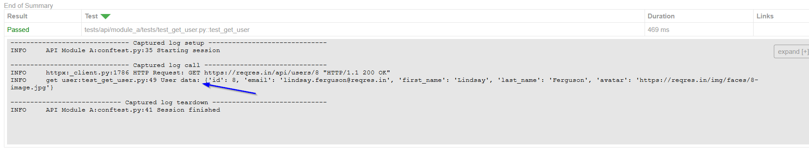

# Python-testing-framework

### To install pytest, playwright, httpx, and more in your virtual environment, you can use the following commands:

**Run the following command to create a virtual environment:**
```Bash
python -m venv python-testing-framework
```

**Activate the Virtual Environment:**
```Bash
python-testing-framework\Scripts\activate
```

**Install Packages:**
```Bash
pip install pytest playwright httpx python-dotenv aiofiles pytest-html jsonschema pytest-asyncio
```

**Install playwright Browsers:**
```Bash
playwright install
```

**Export the installed packages to a requirements.txt file:**
```Bash
pip freeze > requirements.txt
```

**Done? -> Deactivate the Virtual Environment:**
```Bash
deactivate
```

**Install packages from requirements.txt:**
```Bash
pip install -r requirements.txt
```

**To list all virtual environments created using venv or other tools like virtualenv, you can use:**
```Bash
dir /s /b activate
```

# API Testing:

### Setup:
To ensure that your imports work correctly with pytest, you typically need to follow these steps:

1. **Ensure `__init__.py` files are present**: Make sure that each directory in your package has an `__init__.py` file.<br> 
This file can be empty but is necessary for Python to recognize the directory as a package.

    Your directory structure should look like this:
    ```Bash
    python-testing-framework/
    ├── pytest.ini
    ├── tests/
    │   ├── __init__.py
    │   ├── api/
    │   │   ├── __init__.py
    │   │   │
    │   │   ├── core/
    │   │   │   ├── __init__.py
    │   │   │   └── apis_info.py
    │   │   │
    │   │   ├── module_a/
    │   │   │   ├── __init__.py
    │   │   │   ├── conftest.py
    │   │   │   │
    │   │   │   ├── setup/
    │   │   │   │   ├── __init__.py
    │   │   │   │   └── cognito_token.py
    │   │   │   │
    │   │   │   ├── tests/
    │   │   │   │   ├── __init__.py
    │   │   │   │   └── test_get_user.py
    ```
2. **Use relative imports**: to reference modules within the same package.<br> For example, in `test_get_user.py`, you should use:
    ```Python
    from ...core.apis_info import ApiAbbreviation, apiUrls
    ```

3. **Set the `PYTHONPATH` environment variable**: to the root directory of your project to ensure Python can find the modules correctly.<br> This step is necessary if you are running the tests from a different directory.
    ```Bash
    set PYTHONPATH=C:\xxx\xxx\python-testing-framework
    ```

4. **Run pytest from the root directory**: of your project to ensure it can find all the necessary modules and packages.
    ```Bash
    pytest -s tests/api/module_a/tests/test_get_user.py --html=report.html
    ```

---

### Global fixtures:
In pytest, you can create global fixtures by defining them in a file called `conftest.py`.<br>
This file should be located in your project's root directory or in any directory containing tests.<br>
Pytest will automatically discover `conftest.py` files and the fixtures defined in them,<br> 
and these fixtures will be available to all tests in your project/folder.

---

### Hooks:
Are special functions that pytest will automatically call at certain points during the testing process.<br><br>
`def pytest_sessionstart(session):`<br>
This function is a pytest hook that is automatically called once before any tests or test cases are run.

`def pytest_sessionfinish(session, exitstatus):`<br> 
This function is another pytest hook that is automatically called once after all tests and test cases have finished running.<br>
This might be done to clean up after the tests, or to ensure that the token isn't accidentally used outside of the testing session.

The `session` parameter in both `pytest_sessionstart` and `pytest_sessionfinish`<br>
is a Session object that contains information about the testing session, such as the tests that are being run and their status.<br>
The `exitstatus` parameter in `pytest_sessionfinish` is the exit status of the testing session,<br> 
which can be used to determine if the tests passed or failed.

---

### HTML reports:
For generating HTML reports in pytest, the most commonly recommended tool is pytest-html.<br> 
It is a plugin for pytest that generates a detailed HTML report for test sessions.<br> 
This report includes the summary of the test outcomes, categorization of tests (passed, failed, skipped, etc.),<br> 
and can also include additional information like logs, links, and screenshots if configured.

Run pytest with HTML report option: When running pytest, add the `--html` flag followed by the name of the report file you wish to generate.<br> 
This command will execute your tests and generate an HTML report named `report.html` in your current directory.

```Bash
pytest --html=report.html
```

1. **Custom Report Title**: to set a custom title for the HTML report.

```Bash
pytest --html=report.html --html-report-title="My Test Report"
```

2. **Include Environment Section**: To include an environment section in the report, you can use the --metadata option to add each key-value pair.

```Bash
pytest --html=report.html --metadata Browser Firefox --metadata Environment Test
```

You can put many pytest configuration options, including those for pytest-html, into a configuration file so you don't need to enter them every time you run a script.<br>
The most commonly used configuration file for pytest is `pytest.ini`

```Python
[pytest]
addopts =
    --html=report.html
    --metadata Browser Chrome
    --metadata Environment Test
```


(Environment can also be set inside the `conftest.py` file comming from the `.env` file)<br><br>
This configuration will automatically apply the specified options every time you run pytest, generating an HTML report titled "report.html" with the additional metadata and custom CSS specified.

For options that cannot be directly included in the configuration file, like adding extra links or assets through markers or modifying the pytest metadata within a test, you'll need to handle those within your test files or through custom plugins or hooks.

Remember to place the `pytest.ini` file at the root of your project or in a location where pytest can automatically detect it.

#### HTML report configuration for this framework:

`pytest.ini` :<br>
Specifies the HTML report output file:
```Python
[pytest]

...

addopts =
    --html=report.html
```

`conftest.py`<br>
Imports the custom HTML summary function:
(You do not need to call it directly; pytest will call it as part of its hook system.)
```Python
from ..core.html_summary import pytest_html_results_summary
```


`html_summary.py` :<br>
Contains the custom HTML summary function for the pytest-html plugin.<br> This function adds environment information to the HTML report in a styled table format.
```Python
import os

def pytest_html_results_summary(prefix, summary, postfix):
    environment = os.getenv("ENVIRONMENT")
    
    # Create a table with environment information using raw HTML and CSS
    table_html = """
    <style>
        .summary-table {{
            width: 20%;
            border-collapse: collapse;
            margin: 15px 0;
            font-size: 11px;
            text-align: left;
        }}
        .summary-table th, .summary-table td {{
            padding: 12px 15px;
            border: 1px solid #ddd;
        }}
        .summary-table th {{
            background-color: #f2f2f2;
        }}
    </style>
    <table class="summary-table">
        <tr>
            <th>Key</th>
            <th>Value</th>
        </tr>
        <tr>
            <td>Environment</td>
            <td>{}</td>
        </tr>
    </table>
    """.format(environment)
    
    # Add custom content to prefix
    prefix.extend(["Test Execution Summary"])
    
    # Add the table to the summary
    summary.extend([table_html])
    
    # Add custom content to postfix
    postfix.extend(["End of Summary"])
```


---

### Logging 

The logging configuration is set up using a JSON file and a setup script.<br>
This configuration ensures that logs are written to both the console and a file, and are also captured for inclusion in the HTML report.<br>
(Remove the 'console' logger else the output will show twice inside of the HTML report.)

`logging_config.json` :
```Python
{
    "version": 1,
    "disable_existing_loggers": true,
    "formatters": {
        "standard": {
            "format": "%(asctime)s - %(name)s - %(levelname)s - %(message)s",
            "datefmt": "%Y-%m-%d %H:%M:%S"
        }
    },
    "handlers": {
        "console": {
            "class": "logging.StreamHandler",
            "level": "INFO",
            "formatter": "standard",
            "stream": "ext://sys.stdout"
        },
        "file": {
            "class": "logging.FileHandler",
            "level": "INFO",
            "formatter": "standard",
            "filename": "api_logging.log",
            "mode": "a",
            "encoding": "utf-8"
        }
    },
    "loggers": {
        "": {
            "level": "INFO",
            "handlers": ["console", "file"]
        }
    }
}
```
`loggingSetup.py` :
```Python
import logging
import logging.config
import json
import os

def setup_logging():
    #Setup logging configuration
    path = os.path.join(os.path.dirname(__file__), 'logging_config.json')
    
    with open(path, 'r') as f:
        config = json.load(f) # Load the logging configuration from the JSON file
    
    # Dynamically set the absolute path for the .log file
    log_file_path = os.path.join(os.path.dirname(__file__), 'api_logging.log')
    
    # Clear the log file before adding new logs
    with open(log_file_path, 'w'):
        pass
    
    config['handlers']['file']['filename'] = log_file_path
    
    # Configure logging using the dictionary loaded from the JSON file
    logging.config.dictConfig(config) 
```

`conftest.py` :<br>
The **tests/api/module_a** directory contains fixtures and hooks for the test session.<br>
It includes environment variable loading, asynchronous setup and teardown, **logging setup**, and custom HTML summary configuration.

```Python
from ..core.loggingSetup import setup_logging 

# Setup logging configuration
setup_logging()

...

```

`html_summary.py` :<br>
In the **tests/api/core** directory contains the custom HTML summary function for the pytest-html plugin.<br>
This function captures log output and adds it to the HTML report.

**if report.when == 'call':**
- This checks if the current phase of the test is the "call" phase.
- The "call" phase is when the actual test function is executed. Other phases include "setup" and "teardown".
- This ensures that the log messages are only added for the main execution phase of the test.

**log_output = "\n".join(report.caplog):**
- This line captures the log output generated during the test.
- **report.caplog** is assumed to be a list of log messages (strings) captured by the caplog fixture.
- **"\n".join(report.caplog)** joins all the log messages into a single string, with each message separated by a newline character (\n).

**cells.append(html.div(log_output, class_='log'))**
- This line adds the captured log output to the HTML report.
- **html.div(log_output, class_='log')** creates a new HTML `<div>` element containing the log output.
    - **log_output** is the string of joined log messages.
    - **class_='log'** assigns the CSS class "log" to the `<div>` element, which can be used for styling purposes.
- **cells.append(...)** adds this `<div>` element to the list of HTML cells for the current test row.

```Python
...

def pytest_html_results_table_row(report, cells):
    if report.when == 'call':
        # Add captured log output to the HTML report
        log_output = "\n".join(report.caplog)
        cells.append(html.div(log_output, class_='log'))

...
```

`test_get_user.py` :<br>
The test uses the logger to log messages, which are captured by the caplog fixture and included in the HTML report.

The caplog fixture is used to capture log messages generated during the execution of a test. Here’s how it works:

1. **Capturing Logs**:
    - The **caplog** fixture captures all log messages emitted during the test.
    - It allows you to assert that certain log messages were generated, check their content, and include them in reports.

2. **Accessing Captured Logs**:
    - **caplog** provides several attributes and methods to access the captured log messages.
    - **caplog.records**: A list of LogRecord objects for each captured log message.
    - **caplog.text**: A string containing all captured log messages.
    - **caplog.clear()**: Clears the captured log messages.

```Python
import logging

# Configure the logger
logger = logging.getLogger(__name__)

# Log the user data (for capturing in the HTML report)
logger.info(f"User data: {user}")

...
```
<br>

`report.html` :<br>


`api_logging.log` :
```Log
2024-11-01 07:40:52 - httpx - INFO - HTTP Request: GET https://reqres.in/api/users/8 "HTTP/1.1 200 OK"
2024-11-01 07:40:52 - tests.api.module_a.tests.test_get_user - INFO - User data: {'id': 8, 'email': 'lindsay.ferguson@reqres.in', 'first_name': 'Lindsay', 'last_name': 'Ferguson', 'avatar': 'https://reqres.in/img/faces/8-image.jpg'}
```

---

### Marks

Pytest marks allow you to categorize your tests, making it easier to manage and execute subsets of your test suite based on certain criteria.

`@pytest.mark.slow`:
- **Purpose**: This mark is used to label tests that are slow to execute. You can use this mark to exclude or specifically include slow tests during test runs, optimizing your development workflow.<br>
- **Example Usage**: Running only fast tests by excluding the slow ones with a command like `pytest -k "not slow"`.

`@pytest.mark.xfail`:
- **Purpose**: Marks a test that is expected to fail. This is useful when a known bug is present, and the test will pass once the bug is fixed.<br>
- **Example Usage**: Allows the test suite to pass in a CI/CD pipeline despite the presence of a known failing test, without hiding the test failure.<br>
    ```Python
    @pytest.mark.xfail(reason="This test is expected to fail due to bug #123")
    ```

`@pytest.mark.skip`:
- **Purpose**: Skips the execution of the marked test function. This is useful for tests that are not applicable under certain conditions or if a feature is not yet implemented.<br>
- **Example Usage**: Temporarily disabling a test that relies on a feature not yet available in the development environment <br>
    ```Python
    @pytest.mark.skip(reason="Skipped because feature #456 is not yet implemented")
    ```

`@pytest.mark.custom_mark`:
- **Purpose**: Demonstrates how to create a custom mark. Custom marks can be used to categorize tests in any way that suits your project's needs.<br>
- **Example Usage**: Running a specific subset of tests tagged with a custom mark, like `pytest -m custom_mark`.<br>
- To use custom marks in pytest, you need to register them in your pytest configuration file (usually pytest.ini).<br> This registration step is necessary to avoid warnings about unregistered marks.
    ```Python
    # pytest.ini
    [pytest]
    markers =
        custom_mark: This is a custom mark with a message
    ```
    ```Python
    @pytest.mark.custom_mark(reason="This is a custom mark with a message")
    ```

`@pytest.mark.parametrize`:
- **Purpose**: Allows one to define multiple sets of arguments and expected results for a test function. Pytest will run the test function once for each set of arguments.<br>
- **Example Usage**: Testing a function with various inputs to ensure it behaves as expected in different scenarios.<br>
- **Attributes**: The parameters num, expected followed by a list of tuples, each representing a test case with an input (num) and the expected output (expected).